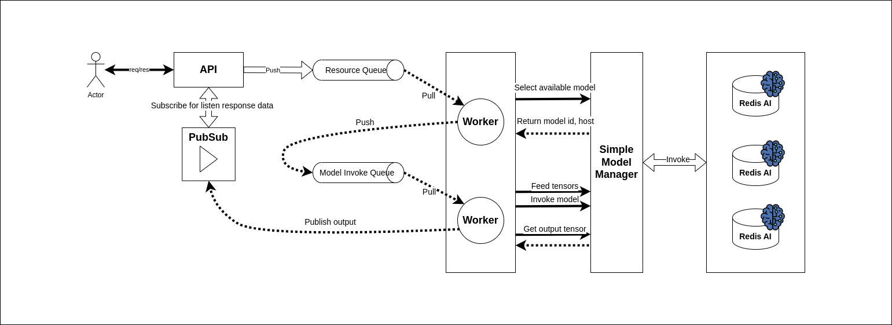
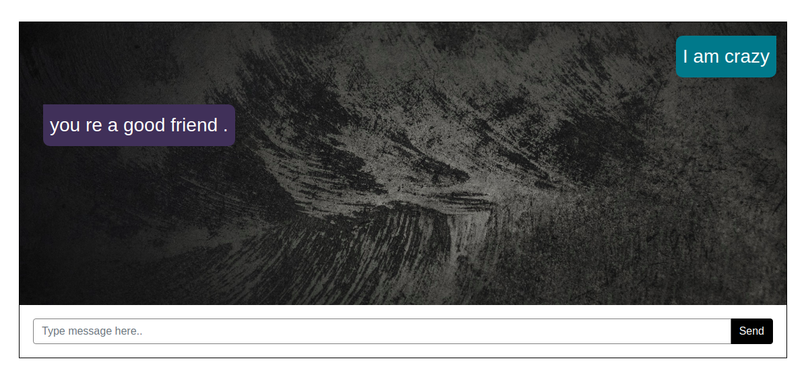

# Resource Management with Redis AI 
An example that showcases the benefit of running AI inside Redis.

This repository references from [Chat Bot Demo](https://github.com/RedisAI/ChatBotDemo). I recommend checkout the parent
repo to have the overview of Redis AI.

## Architecture


Instead of direct invoke model in APIs, our solution is routing task to most efficient model on all Redis AI instance, and allow locking if needed.
This make our system horizontally scalable.
It can describe by bellow steps:
- Step 1: User receive user request, push is to 'Resource Manager Queue', and waiting for response on task Redis PubSub channel (which is task id).
- Step 2: Worker pick up the task and find best host/model. If model be found, create new invoke task and push to invoke queue with model and host information. If not, the task will be retried until one available.
- Step 3: Workers will pick the invoke task and process it. The invoking will include multiple tensor feed, invoke calls to the Redis AI base on the AI model that need to run. After finished, result will be push back to API by Redis PubSub.
- Step 4: API return response to user if is final response.

## Requirements
* Docker
* Docker-compose

## Running

```
$ git clone https://github.com/phamvanvuhb1999/workhorse.git
$ cd workhorse
$ docker-compose up
```

### API
Try out the API (we have only one API endpoint -> `/chat` which accepts `message` as the JSON key with your message as value) using `curl` as shown below.

```
curl http://localhost:5000/chat -H "Content-Type: application/json" -d '{"message": "I am crazy"}'
```

After that, you could try with '/orc' API to see the resource manager be implemented with Celery work.

### UI
Open a browser and point it to `http://localhost:5000`, you'll see the chat view that still be keep from the parent repo.


